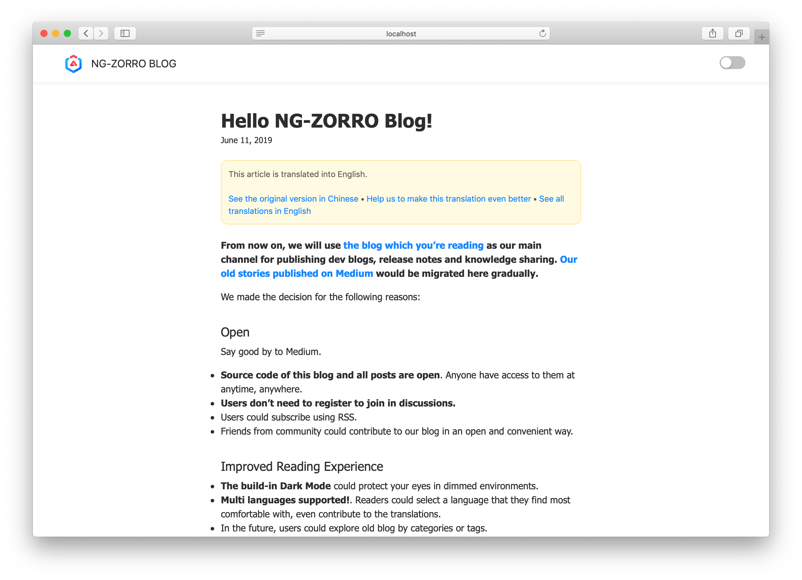
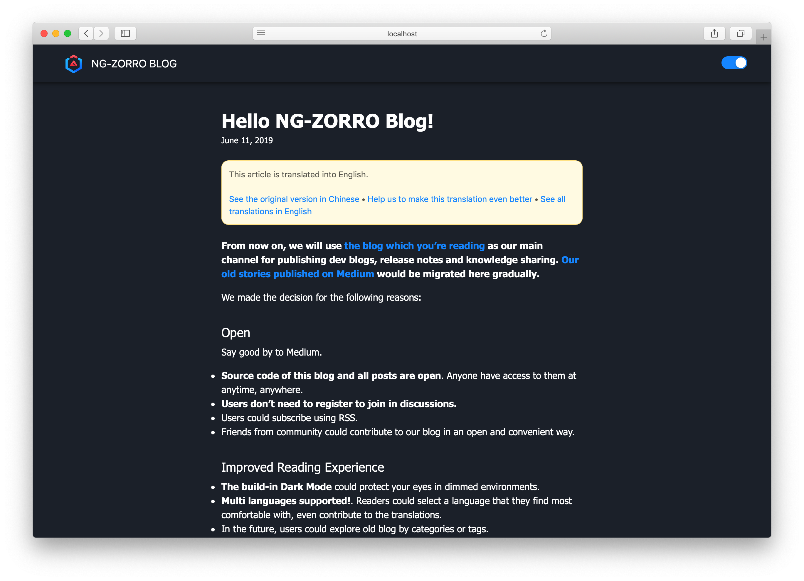

  

<h1 align="center">
NG-ZORRO Blog
</h1>

## Write

Follow these steps to write a new article:

- Create a dir under `content/blog/`.
- Create an `index.md` file which would be considered as the main content.
  - All static resources can be put into the same dir.
  - (Optional) Create translations with name patterns like `index.{languageId}.md`.

### Metadata

- title
- date
- (Optional) description
- (Optional) author
- (Optional) category
- (Optional) tags

### Dark Mode

Built-in Dark Mode.

## License

MIT
