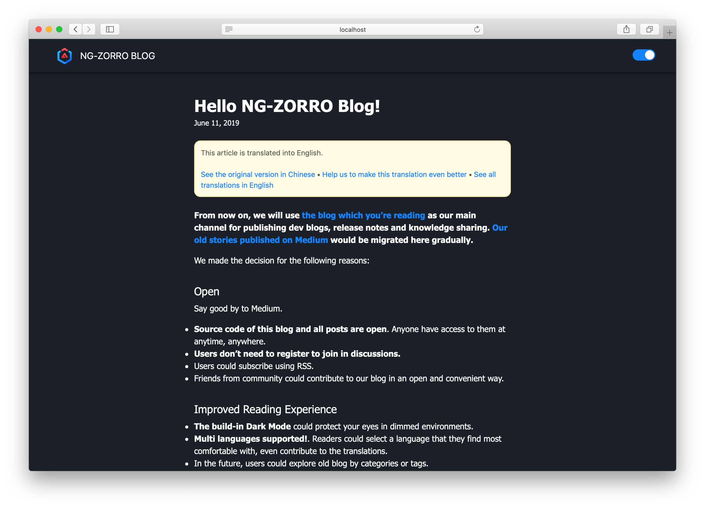

  

<h1 align="center">
NG-ZORRO Blog
</h1>

## 写博客

按照以下步骤来撰写一篇博客：

- 在 `content/blog/` 目录底下创建一个新目录
- 在该目录中创建 `index.md` 文件，它将会被当作默认语言（简体中文）的博客文章内容
  - 所有的静态资源都应该放置在同一个目录底下
  - （可选）创建一个名为 `index.{languageId}.md` 的文件可为默认语言的博客创建一个对应语言的译文

### Metadata

- title
- date
- description
- (Optional) author
- (Optional) category. 请确保你在源文件中用的是一个 URL 友好的标识符，并且在 `i18n.js` 文件中提供了翻译
- (Optional) tags. 请确保你在源文件中用的是一个 URL 友好的标识符，并且在 `i18n.js` 文件中提供了翻译

### 黑暗模式

内建了黑暗模式

## License

代码以 MIT 授权协议开源，文章以 Creative Common 4.0 协议共享。
