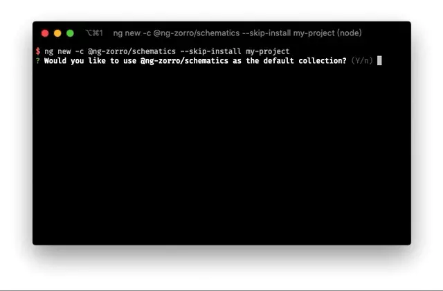

# 使用自定义 Schematics 初始化项目



本文将介绍如何编写一个用于初始化项目的 Schematics。

## 开始之前

之前我们介绍过如何 [使用 Schematics 自定义 ng generate](/ng-schematics)，其中主要讨论如何通过自定义 Schematics 在 Angular 项目中使用**预制模板**快速创建项目的组成部分，比如组件(Component)、服务(Service)、接口(Interface)等。

而本文主要讨论通过自定义 Schematics 创建新应用(Application), 或者说是定制**工作空间(Workspace)**。

在项目迭代中我们常常会使用 `ng g c [name]` 帮助我们创建新的组件模块，或者使用 `ng add [libaray-name]` 添加一个新的依赖(如果支持的话)，这的确能帮助我们节省不少的时间，但是在通过 `ng new [name]` 新建一个项目时官方给我们提供的选项并不多。

我们在创建新项目后一般还会进行如下配置：

- 将生成组件命令的 changeDetectionStrategy 选项修改为 OnPush
- 在 `tsconfig.json` 中添加路径映射
- 添加 commitlint 规范提交消息
- 添加 prettier 规范代码格式
- 使用更严格的 TSLint 选项
- 添加拦截器(Interceptor)
- 添加服务端代理配置
- 添加对应的 githook

这导致我们在新建项目之后还需要根据一些个人喜好或者团队规范进行一番配置才能开始开发，如果算上 npm install 的时间一上午就过去了(误)。

不过好在 Angular 给我们提供了扩展的机会，运行 `ng new --help` 会看见一个名为 `--collection (-c)` 的选项，可以**指定用于初始化项目的 Schematics**。

## 开始

知道了如何指定初始化项目的 Schematics 接下来我们就进行开发。

首先初始化项目(npm init)并安装必要的依赖:

```json
{
  "name": "my-schematics",
  "version": "1.0.0",
  "devDependencies": {
      "@angular-devkit/core": "^8.3.20",
      "@angular-devkit/schematics": "^8.3.20",
      "@schematics/angular": "^8.3.20",
      "@types/fs-extra": "^8.0.1",
      "@types/node": "^12.12.16",
      "fs-extra": "^8.1.0",
      "rimraf": "^3.0.0",
      "ts-node": "^8.5.4",
      "tslint": "^5.20.1",
      "typescript": "^3.7.3"
  }
}
```

然后在项目下新建一个 `src` 目录作为源码目录并且新建一个 `index.ts` 文件, 然后运行 `tsc --init` 目录初始化 `tsconfig.json` 文件，或者直接使用下面的配置:

```json
{
  "compilerOptions": {
    "stripInternal": true,
    "experimentalDecorators": true,
    "strictPropertyInitialization": false,
    "moduleResolution": "node",
    "downlevelIteration": true,
    "outDir": "dist/schematics",
    "sourceMap": true,
    "inlineSources": true,
    "lib": ["es2017", "dom"],
    "skipLibCheck": true,
    "strict": true,
    "types": ["node"]
  },
  "files": ["src/index.ts"]
}
```

其中 `"files": ["src/index.ts"]` 指定需要编译的**入口文件**，`"outDir": "dist/schematics"` 指定编译结果的**输出目录**。

然后在 `package.json` scripts 加入以下字段:

```json
{
  "scripts": {
    "clean": "rimraf dist",
    "prebuild": "npm run clean",
    "build": "tsc -p tsconfig.json"
  }
}
```

运行 `npm run build`，完成后如果能在 `dist/schematics` 看见正确的输出便说明这步完成。

## 开发 Schematics

> 如果对开发 Schematics 的基础知识不了解建议先阅读 [使用 Schematics 自定义 ng generate](/ng-schematics)

在 src 目录下新建如下文件：

```
src
├── collection.json
├── index.ts
├── ng-new
│   ├── index.ts
│   ├── schema.json
│   └── schema.ts
└── workspace
    ├── files
    ├── index.ts
    ├── schema.json
    └── schema.ts

```

修改 `collection.json` 文件内容。

```json
{
  "extends": ["@schematics/angular"],
  "schematics": {
    "ng-new": {
      "factory": "./ng-new",
      "schema": "./ng-new/schema.json",
      "description": "Create an Angular workspace.",
      "hidden": true
    },
    "my-workspace": {
      "factory": "./workspace",
      "schema": "./workspace/schema.json",
      "description": "Create an Angular workspace.",
      "hidden": true
    }
  }
}
```

-  `"extends": ["@schematics/angular"]` 是继承 Angular 官方的 Schematics，这样你不会失去原有的功能；
- `ng-new` 则是覆盖官方的 `ng-new`，这 是一个固定的 Schematic 名，对应用户运行 `ng new` 所执行的 Schematic；
- `my-workspace` 是为了将初始化工作空间(Workspace)的逻辑分类出来作为一个单独的 Schematic，当然，你也可以将所有逻辑写在 `ng-new` 中。（注意：不要使用 `workspace` 这个名字，因为会与官方命名冲突导致行为覆盖）。

## ng-new

接下来定义 `ng-new` 的 Schema，它对应了 `src/ng-new/schema.ts` 以及 `src/ng-new/schema.json`，这里要分两种情况。

- 情况一：“我只希望在官方的结果上扩展”

这种情况你只需要在 Schema 中定义你的新选项即可。

- 情况二：“我需要修改官方行为，或者依赖它的选项”

这种情况你需要将依赖的选项重写一边，然后再添加新字段，你可以在 [angular/ng-new/schema.json](https://github.com/angular/angular-cli/blob/master/packages/schematics/angular/ng-new/schema.json) 中找到全部配置。

接下来的内容以第二种情况为例，如果你只关心第一种情况请不要担心，下面的内容完全包含了它。

假设我们希望在创建项目之后添加一个 `app.interceptor.ts` 拦截器文件，并声明到 `AppModule` 定义的 `providers` 字段中。这将修改官方生成 `app.module.ts` 的逻辑。

首先将 [angular/ng-new/schema.json](https://github.com/angular/angular-cli/blob/master/packages/schematics/angular/ng-new/schema.json) 的全部内容拷贝到 `ng-new/schema.json` 中然后修改 `ng-new/schema.json` 文件内容添加自定义字段(interceptor)：

```json
{
  "properties": {
    "interceptor": {
      "type": "boolean",
      "description": "When true, generates an interceptor service for the initial project.",
      "default": false,
      "x-prompt": "Would you like to add HTTP interceptor?"
    }
  }
}
```

这里的 `x-prompt` 是 JSONSchema 的扩展字段，用于 CLI 创建交互式命令。

修改 `schema.ts` 内容，继承官方 `ng-new` Schema 并添加自定义字段:

```ts
import { Schema as NgNewSchema } from '@schematics/angular/ng-new/schema';

export interface Schema extends NgNewSchema {
  interceptor?: boolean;
}
```

然后编写 `ng-new/index.ts` 的内容：

```ts
import {
  Rule,
  SchematicContext,
  Tree,
  chain,
  externalSchematic,
  mergeWith,
  apply,
  empty
} from '@angular-devkit/schematics';

import { Schema as SchematicOptions } from './schema';
import { validateProjectName } from '@schematics/angular/utility/validation';

export default function(options: SchematicOptions): Rule {
  return (host: Tree, context: SchematicContext) => {

    // 解构原配置
    const { interceptor, ...angularOptions } = options;

    return chain([
      mergeWith(
        apply(empty(), [
          // 运行外部 Schematic
          externalSchematic('@schematics/angular', 'ng-new', {
            ...angularOptions
          }, {
            // 关闭交互式命令行
            interactive: false
          })
        ])
      )
    ])(host, context);
  };
}
```

这里通过解构操作符提取了扩展字段之后我们会用到它，接下来调用 `externalSchematic` 方法来运行官方的 `ng-new` Schematic，需要注意的是这里传入了 `interactive: false` 配置来关闭交互式命令行，因为我们已经在 `ng-new/schema.json` 覆盖了它全部的配置，这会导致要求用户输入相同的选项，所有这里关闭了 `@schematics/angular:ng-new` 的交互式命令行。

## my-workspace

接下来定义 `my-workspace` Schematic 来扩展我们的功能，修改 `workspace/schema.json` 和 `workspace/schema.ts`:

```ts
export interface Schema {
  interceptor?: boolean;
  routing?: boolean;
}
```

```json
{
  "$schema": "http://json-schema.org/schema",
  "id": "SchematicsAngularWorkspace",
  "title": "Angular Workspace Options Schema",
  "type": "object",
  "properties": {
    "interceptor": {
      "type": "boolean",
      "description": "When true, generates an interceptor service for the initial project."
    },
    "routing": {
      "type": "boolean",
      "description": "When true, generates a routing module for the initial project."
    }
  }
}
```

这里不需要 `x-prompt` 字段，因为我们将直接通过 API 调用。

然后创建 `workspace/files/src/app` 下创建 `app.interceptor.ts.template` 和 `app.module.ts.template` 模板文件。

app.interceptor.ts.template
```
import { Injectable } from '@angular/core';
import {
  HttpEvent,
  HttpInterceptor,
  HttpHandler,
  HttpRequest
} from '@angular/common/http';

import { Observable } from 'rxjs';

@Injectable()
export class AppInterceptor implements HttpInterceptor {

  intercept(req: HttpRequest<any>, next: HttpHandler):
    Observable<HttpEvent<any>> {
    return next.handle(req);
  }
}
```

app.module.ts.template

```
import { BrowserModule } from '@angular/platform-browser';<% if (interceptor) { %>
import { HttpClientModule, HTTP_INTERCEPTORS } from '@angular/common/http';<% } %>
import { NgModule } from '@angular/core';
<% if (routing) { %>
import { AppRoutingModule } from './app-routing.module';<% } %>
import { AppComponent } from './app.component';
import { AppInterceptor } from './app.interceptor';

@NgModule({
  declarations: [
    AppComponent
  ],
  imports: [
    HttpClientModule,
    BrowserModule<% if (routing) { %>,
    AppRoutingModule<% } %>
  ],<% if (interceptor) { %>
  providers: [
    {
      provide: HTTP_INTERCEPTORS,
      useClass: AppInterceptor,
      multi: true
    }
  ],<% } %>
  bootstrap: [AppComponent]
})
export class AppModule { }
```

编写 `workspace/index.ts` 文件

```ts
import {
  Rule,
  chain,
  noop,
  apply,
  mergeWith,
  url,
  applyTemplates,
  filter,
  MergeStrategy
} from '@angular-devkit/schematics';

import { Schema as SchematicOptions } from './schema';

export default function (options: SchematicOptions): Rule {

  return chain([
    mergeWith(
      apply(
        url('./files'),
        [
          // 如果添加 Interceptor 则执行空操作
          options.interceptor ? noop() : filter(path => !path.endsWith('interceptor.ts.template')),
          // 应用模板
          applyTemplates({...options})
        ]
      ),
      // 使用覆盖策略
      MergeStrategy.Overwrite
    )
  ]);
}
```

这里的 `url` 会读取模板源文件，如果用户不希望创建拦截器的则通过 `filter` 过滤对应的模板文件，`applyTemplates` 会自动将上下文应用到 `*.template` 文件中。设置合并策略为 `MergeStrategy.Overwrite` 是因为上一部调用官方 `ng-new` 时已经创建了 `app.module.ts` 文件，我们希望将其覆盖，而不是抛错退出。

最后修改 `ng-new/index.ts` 文件，在调用官方 `ng-new` 调用我们的  `my-workspace`：

```ts
import {
  Rule,
  SchematicContext,
  Tree,
  chain,
  externalSchematic,
  mergeWith,
  apply,
  empty, schematic
} from '@angular-devkit/schematics';

import { Schema as SchematicOptions } from './schema';
import { validateProjectName } from '@schematics/angular/utility/validation';

export default function(options: SchematicOptions): Rule {
  // 设置项目目录
  if (!options.directory) {
    options.directory = options.name;
  }

  // 验证目录
  validateProjectName(options.directory);

  return (host: Tree, context: SchematicContext) => {

    // 结构原配置
    const { interceptor, ...angularOptions } = options;

    return chain([
      mergeWith(
        apply(empty(), [
          // 运行外部 Schematic
          externalSchematic('@schematics/angular', 'ng-new', {
            ...angularOptions
          }, {
            // 关闭交互式命令行
            interactive: false
          }),
          // 调用 `my-workspace` Schematic
          schematic('my-workspace',  {
            interceptor,
            routing: angularOptions.routing
          }, {
            // 设置 scope 为项目目录
            scope: options.directory
          })
        ])
      )
    ])(host, context);
  };
}
```

这里使用了 `schematic` 方法来执行内部 Schematic，需要注意的是这里设置了 `scope: options.directory` 是因为 Schematic 的默认目录是命令行的运行目录，与 `ng-new` 不同的是 `my-workspace` 是运行在创建的项目目录下，所有这里需要指定一下，否则文件会被创建到外面去。

## 打包发布

这时运行 `npm run build`, 所有 ts 文件都被编译到了 `dist/schematics` 中，但是它还没办法被 Angular 识别，我们需要将配置文件一同拷贝到 `dist/schematics`，这里 Angular 并没有提供想要的开发工具，不过可以用 NodeJS 写个脚本帮助我们。

新建一个 `scripts/copy-resources.ts` 文件：

```ts
import * as fs from 'fs-extra';
import * as path from 'path';

const srcPath = path.join(process.cwd(), 'src');
const targetPath = path.join(process.cwd(), 'dist/schematics');
const copyFilter = (p: string) => !p.endsWith('.ts');

export function copyResources(): void {
  fs.copySync(srcPath, targetPath, { filter: copyFilter });
  fs.copyFile(path.join(process.cwd(), 'README.md'), path.join(targetPath, 'README.md'));
  fs.copyFile(path.join(process.cwd(), 'LICENSE'), path.join(targetPath, 'LICENSE'));
  fs.copyFile(path.join(process.cwd(), 'package.json'), path.join(targetPath, 'package.json'));
}
copyResources();
```

再在它同级新建一个 `tsconfig.json` 文件：

```json
{
  "extends": "../tsconfig",
  "files": ["./copy-resources.ts"]
}
```

然后向 package.json 添加如下字段：

```json
{
  "scripts": {
    "clean": "rimraf dist",
    "copy:resources": "ts-node --project scrtips/tsconfig.json scrtips/copy-resources.ts",
    "prebuild": "npm run clean",
    "postbuild": "npm run copy:resources",
    "build": "tsc -p tsconfig.json"
  },
  "schematics": "./collection.json"
}
```

这里在 `build` 完成后自动执行 `copy:resources` 拷贝资源，`schematics` 字段则是告诉 CLI Schematics 配置文件的位置。

然后运行 `npm run build`，我们将会在 `dist/schematics` 的到一个可发布的 npm 包。你可以通过 `npm link`、`npm pack` 或者其他方式将它安装的全局进行测试。

## 最后

我们通过覆盖 `ng-new` 编写了一个自定义 Schematics 为新的 Angular 项目添加了自定义拦截器选项，在实际开发中我们往往需要进行更多的配置，NG-ZORRO 团队就文章开头所列出的几项开发了一套自定义 Schematics [@ng-zorro/schematics](https://github.com/NG-ZORRO/schematics) 供大家使用，你也可以根据自己的需求扩展更多功能和选项。 感谢阅读，Time is money, friend!
