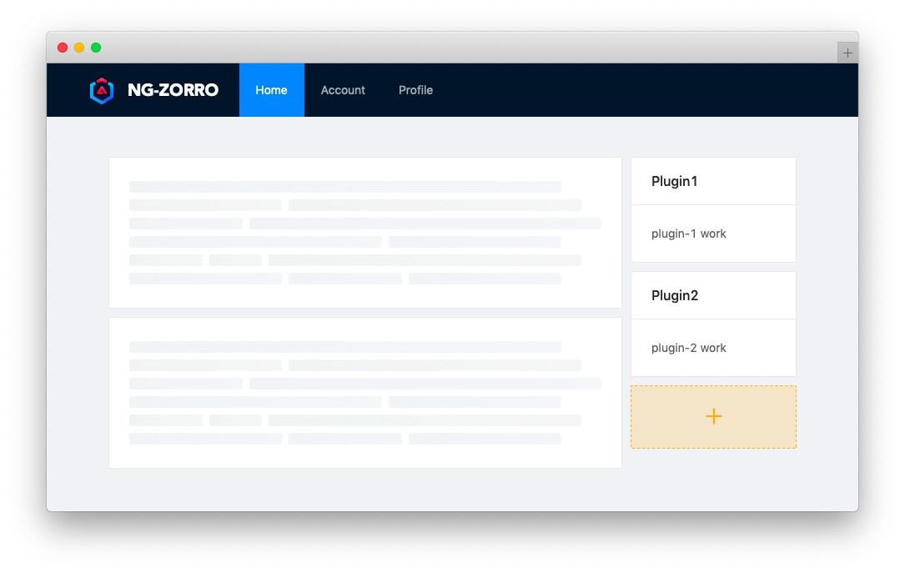

# 构建插件化的 Angular 应用

本文将介绍如何在生产环境中动态加载外部模块，用于实现插件化的 Angular 应用。

## 背景

当某些一系列功能具有相同的视图模型，你又需要常常修改或者增加它们；又或者你允许用户或第三方为应用添加某些特性时，就需要为应用提供一种在不修改核心代码也不重新编译的情况下可以动态加载组件或模块的能力。也就是本文要讨论的插件化。

## 目标

- 只使用 Angular CLI 对插件进行开发和编译
- 能够动态加载插件
- 能与核心应用共享外部依赖
- 一个简单的插件注册与加载服务

接下来让我们分别实现每个目标。

## 编写一插件

假设我们现在只需要实现一个类似 Wordpress 的侧边栏小部件的功能, 用户可以按照自己的喜好添加或者开发这些小部件, 就像下面这样



这里我们直接使用 Angular CLI 创建的 library 项目来开发插件，在命令行输入这样的命令：

```shell
ng g library plugin-a
```

此时 CLI 在项目中 `projects/plugin-a` 位置插件了一个 library 项目，并且更新了 `angular.json` 与 `tsconfig.json` 等文件。
首先将 `tsconfig.json` 中生产的对应 `paths` 字段移除，因为这会影响到我们接下来的动态加载。然后将组件添加到模块的 `entryComponents`
中，再运行下面的命令打包:

```shell
ng build plugin-a
```

完成后打包结果会输出在 `dist/plugin-a` 目录中，然后将 `bundles/` umb 包拷贝到 `src/assets/plugin-a` 目录下，
这一步时为了在开发时能够访问到 `assets` 文件夹中的资源以模拟动态加载，通常后端应该提供一套管理插件资源的机制，上线之后可以通过支持跨域的资源服务器加载。

## 动态加载

在 Angular 8.x 版本新建的项目已经模式使用 `esnext`，这意味着我们可以使用动态模块导入的功能，就像这样：

**assets/some_plugin.js**

```js
export const hello = 'hello world';
```

**app.component.ts**

```ts
constructor() {
    loadModule('./assets/some_plugin.js') // Module { hello: "hello world" }
}

loadModule(path: string) {
  import(/* webpackIgnore: true */path).then(module => {
    console.log(module);
  });
}

```

这的 `/* webpackIgnore: true */` 是为了忽略下面的警告。

```shell
WARNING in app.ts 2:11-15
Critical dependency: the request of a dependency is an expression
```

看上去工作的不错，但是当们如果在插件中依赖了某个 node_modules 中的模块时情况就不一样了。

**assets/some_plugin.js**

```js
import { BrowserModule } from '@angular/platform-browser';
//       ^^^^^^^^^^^^^
export const hello = 'hello world';
```

此时浏览器会抛出类似这样的错误:

```shell
zone-evergreen.js:359 ERROR Error:
Uncaught (in promise): TypeError: Failed to resolve module specifier "@angular/platform-browser".
Relative references must start with either "/", "./", or "../".
```

这是因为在浏览器环境下无法解析这样的资源路径，因此在这里我们使用 `System.js` 动态加载模块，Angular 在早期版本也曾使用过 `System.js` 作为模块加载工具。

首先安装 `System.js` 这里使用最新的 4.x 版本，然后在 `angular.json` 中当前项目配置中的 scripts 添加我们需要的最小版本脚本。

```json
{
 "scripts": [
   "node_modules/systemjs/dist/s.js",
   "node_modules/systemjs/dist/extras/amd.js",
   "node_modules/systemjs/dist/extras/named-register.js",
   "node_modules/systemjs/dist/extras/use-default.js"
 ]
}
```

然后注册我们可能需要的依赖，再加载目标插件。

**common-deps.ts**

```ts
import * as core from '@angular/core';
import * as common from '@angular/common';
import * as forms from '@angular/forms';
import * as router from '@angular/router';
import * as rxjs from 'rxjs';
import * as tslib from 'tslib';

export const COMMON_DEPS = {
  '@angular/core': core,
  '@angular/common': common,
  '@angular/forms': forms,
  '@angular/router': router,
  rxjs,
  tslib
};
```

**app.component.ts**

```ts
import {COMMON_DEPS} from './common-deps';

const SystemJs = (window as any).System;

export class AppComponent {

  constructor() {
    this.defineDeps();
    this.loadModule('plugin-a');
  }

  defineDeps() {
    Object.keys(COMMON_DEPS).forEach(externalKey =>
      (window as any).define(externalKey, [], () => COMMON_DEPS[ externalKey ])
    );
  }

  loadModule(name: string) {
    SystemJs.import(`./assets/plugin-a/${name}.umd.js`)
      .then(() => SystemJs.import(name))
      .then(m => {
        console.log(m);
        /**
        *{
        *  PluginAComponent: ƒ PluginAComponent()
        *  PluginAModule: ƒ PluginAModule()
        *  PluginAService: ƒ PluginAService()
        *}
        */
      });
  }
}

```

这里调用了两次 `SystemJs.import` 是因为 `plugin-a` 是个命名模块，第一次 import 的时只是将资源加载并定义了一个名为 `plugin-a` 的模块。
第二次 import 才真正拿到模块中的内容，因此第二次不会再有网络请求。

## 插件管理服务

接下来我们为插件系统编写一个服务用于管理插件的注册与加载，此服务为应用和插件共用的，因此放到单独的 library 中。运行下面的命令创建一个 library。

```ts
 ng g library plugin-manager
```

然后只留下 module 与 service 文件，删除其他不必要的文件，接下来编写我们的服务。

将 `common-deps.ts` 移动到 plugin-manager 项目中，并且将自身添加到依赖。

```ts
...
import * as manager from '../public-api';

export const COMMON_DEPS = {
  ...
  'plugin-manager': manager,
};
```

再修改 `plugin-manager.service.ts` 文件, 运行 `ng build plugin-manager` 重新编译。

**plugin-manager.service.ts**

```ts
import {Injectable, Type} from '@angular/core';
import {PluginManagerModule} from './plugin-manager.module';
import {COMMON_DEPS} from './common-deps';

const SystemJs = (window as any).System;

export function createPlugin(config: {
  name: string;
  module: Type<any>;
  component: Type<any>
}) {
  return new NgPlugin(config.name, config.module, config.component);
}

export class NgPlugin {
  constructor(
    public name: string,
    public module: Type<any>,
    public component: Type<any>) {
  }
}

@Injectable({
  providedIn: PluginManagerModule
})
export class PluginManagerService {

  depsDefined = false;

  constructor() { }

  defineDeps() {
    if (this.depsDefined) {
      return;
    }
    Object.keys(COMMON_DEPS).forEach(externalKey =>
      (window as any).define(externalKey, [], () => COMMON_DEPS[ externalKey ])
    );
    this.depsDefined = true;
  }

  loadModule(name: string): Promise<NgPlugin> {
    this.defineDeps();
    return SystemJs.import(`./assets/${name}.umd.js`)
      .then(() => SystemJs.import(name))
      .then(plugin => {
        if (plugin instanceof NgPlugin) {
          return Promise.resolve(plugin);
        } else {
          throw new TypeError('This module is not a valid plugin');
        }
      });
  }
}
```

这里通过 `PluginManagerService` 服务提供了一个 `loadModule` 方法用于加载插件，同时还导出了一个叫 `createPlugin` 的工厂方法用于定义插件。

之后修改 `projects/plugin-a/public-api.ts`，重新运行 `ng build plugin-a` 并将 umb 包复制到 assets 文件下。

**projects/plugin-a/public-api.ts**

```ts
import { createPlugin } from 'plugin-manager';
import { PluginAComponent } from './lib/plugin-a.component';
import { PluginAModule } from './lib/plugin-a.module';

export default createPlugin({
  name: 'plugin-a',
  module: PluginAModule,
  component: PluginAComponent
});
```

这里默认导出了一个由 `createPlugin` 工厂创建的 `NgPlugin` 实例。

最后回到主应用中将 `PluginManagerModule` 引入到 `AppModule` 中，并修改 `app.component.ts` 中的加载方法：

**app.component.ts**

```ts
import { PluginManagerService } from 'plugin-manager';

export class AppComponent {

  constructor(private pluginManagerService: PluginManagerService) {
    this.loadModule('plugin-a');
  }

  loadModule(name: string): void {
    this.pluginManagerService.loadModule(name).then(plugin => {
      console.log(plugin);
      /**
      * NgPlugin {
      *   component: ƒ PluginAComponent()
      *   module: ƒ PluginAModule()
      *   name: "plugin-a"
      * }
      */
    });
  }

}

```

到此我们成功的获取了 `NgPlugin` 实例，剩下的便是动态渲染组件。

## 渲染插件

在渲染之前我们还需要编译模块，为了能在 AOT 模式下编译模块我们需要重新提供 Jit 模式下的 Compiler。

**app.module.ts**
```ts
import {Compiler, COMPILER_OPTIONS, CompilerFactory, NgModule} from '@angular/core';
import {JitCompilerFactory} from '@angular/platform-browser-dynamic';

export function createCompiler(compilerFactory: CompilerFactory) {
  return compilerFactory.createCompiler();
}

@NgModule({
  providers: [
    ...
    {provide: COMPILER_OPTIONS, useValue: {}, multi: true},
    {provide: CompilerFactory, useClass: JitCompilerFactory, deps: [COMPILER_OPTIONS]},
    {provide: Compiler, useFactory: createCompiler, deps: [CompilerFactory]},
  ]
})
export class AppModule { }

```

之后就可以在获取插件之后编译模块，然后渲染组件了。在这个例子中我们这样使用：

**app.component.ts**

```ts
import {Compiler, Component, Injector, NgModuleFactory, Type} from '@angular/core';
import { PluginManagerService } from 'plugin-manager';

interface PluginItem {
  moduleFactory: NgModuleFactory<any>;
  component: Type<any>;
  injector: Injector;
  name: string;
}

@Component({
  ...
  templateUrl: './app.component.html'
})
export class AppComponent {

  plugins: PluginItem[] = [];

  constructor(
    private pluginManagerService: PluginManagerService,
    private compiler: Compiler,
    private injector: Injector
  ) {
    this.loadModule('plugin-a');
  }

  loadModule(name: string): void {
    this.pluginManagerService.loadModule(name).then(plugin => {
      if (this.plugins.findIndex(p => p.name === plugin.name) === -1) {
        const moduleFactory = this.compiler.compileModuleSync(plugin.module);
        this.plugins = [...this.plugins, {
          moduleFactory,
          name: plugin.name,
          component: plugin.component,
          injector: this.injector
        }];
      }
    });
  }
}
```

**app.component.html**

```html
...
<ng-container *ngFor="let plugin of plugins">
    <ng-container *ngComponentOutlet="plugin.component;
                                      ngModuleFactory: plugin.moduleFactory
                                      injector: plugin.injector">
    </ng-container>
</ng-container>
```

这里获取到插件之后调用 compileModuleSync 方法得到 moduleFactory，并将需要的信息存入 plugins 数组，再在模板中渲染出来。


需要注意的是这里需要指定 `ngModuleFactory`，否则会找不到 `entryComponents`，同样如果你不使用 `ngComponentOutlet` 指令而是使用其他 API (如CDK)，也需要指定 `ngModuleFactory` 或者 `componentFactoryResolver`。

## 可能存在的问题

1. 为什么不使用 esnext import dynamic？

import 无法直接处理插件的依赖，虽然可以使用它直接加载 umd 包，但是依然需要为项目添加各种模块管理的依赖，社区上也有一些映射依赖路径的实现，有兴趣也可以尝试一下。

2. 是否可以不使用 Jit 编译模块?

理论上时可行的，我们可以尝试通过自定义 Builder 提取 moduleFactory 再输出我们想要的格式，不过这需要单独讨论了。

另外一种方式就是未来 Ivy 引擎可能根本就不需要 moduleFactory 了, 不过现在 ng-packagr 还不支持。

3. 插件如何与主应用交互？

利用 Angular 的依赖注入，你就可以在插件中通过服务轻松的与上层或者其他插件通讯。

在真实的项目中插件应该根据功能去实现特定的接口或者继承某个功能的抽象类，本文为了简单起见并没有包含这部分内容。


## 写在最后

本文简单的介绍了一种利用 Angular CLI 打包插件并且使用 SystemJs 加载的插件化方式，虽然还存在一些缺点但是随着 Angular 的不断迭代应该很快就有更好的实现方式，希望本文的内容能对你有所帮助，感谢阅读 Code is poetry!

- [hsuanxyz/ng-plugin-example](https://github.com/hsuanxyz/ng-plugin-example)
