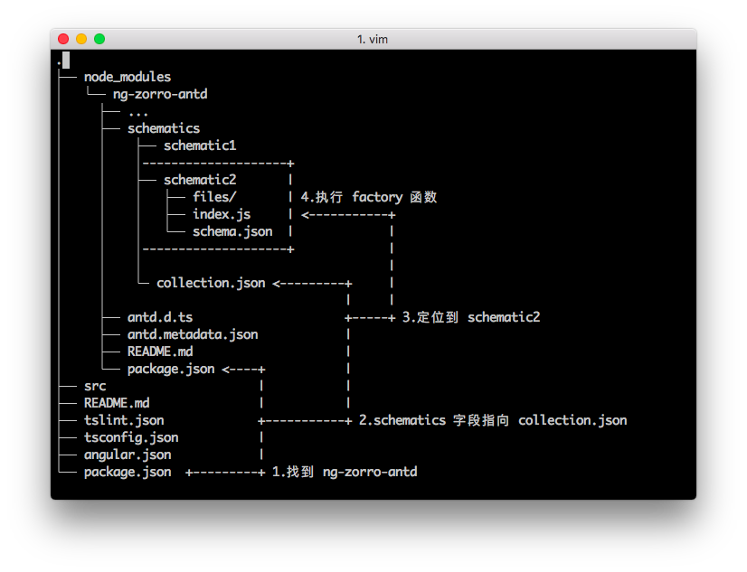
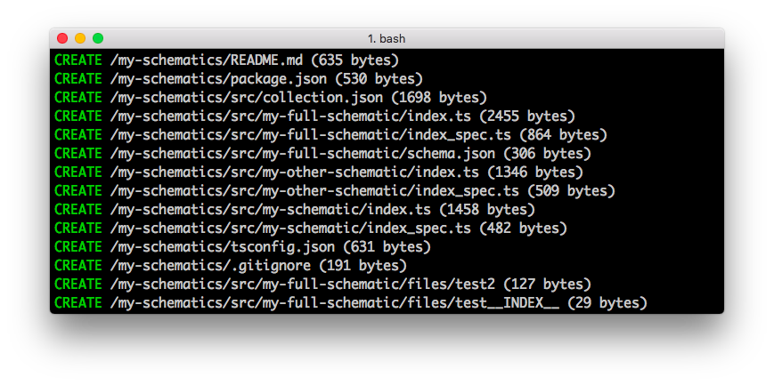
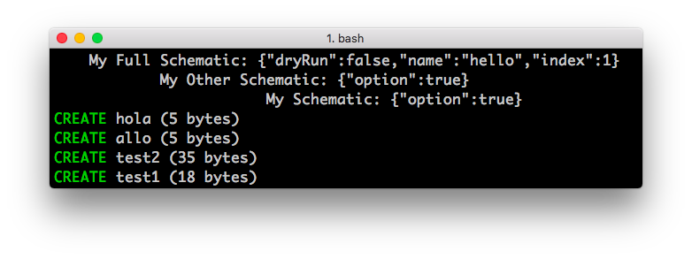

# 使用 Schematics 自定义 ng generate

## 导言

- 本文将介绍哪些类容
	- 什么是 Schematics，以及它与 Angular CLI generate 的关系
	- 如何创建一个 Schematics 项目，以及如何使用 Angular CLI 调用
	- 创建一个自定义的 Component schematic
	- 如何定义 ng-add 和 ng-update

- 词汇解释
	- **Schematics**: 用于描述 generator，对现有的文件系没有副作用
	- **generator**: Angular CLI 生成器，用于执行 Schematic 生成或修改代码
	- **Collection**: 用于定义 Schematics 列表，之后可以按 Schematic 的名称调用


## 介绍

### Schematics 是什么?

> Schematics 是现代前端开发工作流的工具；它可以将变化应用到你的项目中。比如创建一个组件、添加配置项、将框架添加到现有项目，或者更新你的代码来修复更新依赖时带来的 break change。 [Schematics — An Introduction](https://blog.angular.io/schematics-an-introduction-dc1dfbc2a2b2)

### 如何使用？

就和我们常用的 `ng generate component [name]` 一样，Angular6 允许三方库自定义 Schematics，现在 NG-ZORRO 对其做了支持，比如你现在就可以在 Angular6 的项目中试试：

- `ng add ng-zorro-antd`  将 [ng-zorro-antd](https://github.com/NG-ZORRO/ng-zorro-antd) 添加到你的项目中
- `ng g ng-zorro-antd:layout-top-side --name=[name]`  创建一个顶部侧边栏布局的组件

### Angular 是如何找到它的？

下面这张图说明了当我们输入 `ng g ng-zorro-antd:schematic2` 时，Angular 如何找到对应的 schematic。




---


## 起步

首先需要安装全局依赖

```shell
$ npm install -g @angular-devkit/schematics-cli
```

之后使用下面的命令新建一个 scheamtics 项目

```shell
$ schematics schematic --name my-schematics
$ cd my-schematics
$ npm install
```

看到下面的信息就成功创建了一个 Schematics 项目



### 编译 Schematics

运行下面的命令编译 ts 文件，并使用 `npm link` 将 schematics 链接到全局

```shell
$ npm run build
$ npm link
```

### 使用 Angualr CLI 运行

新建一个 Angular 项目，并且将刚才的 schematics `link`  入进来。

```shell
$ ng new schematics-test
$ cd schematics-test
$ npm link my-schematics
```

之后使用 `ng generate` 命令来运行 schematics

```shell
$ ng generate my-schematics:my-full-schematic --name hello
```

现在你应该可以看到 Angular 项目目录多了几个文件



现在我们已经知道如何在 Angular 项目中运行自定义 schematics 了，现在我们来创建一个 Component Schematics

---

## 创建一个真正的 Component


因为官方 API 还处于未完成状态，所以我们先将 [material2/src/lib/schematics](https://github.com/angular/material2/tree/master/src/lib/schematics) 下的 `utils` 文件下载拷贝到 `my-schematics/src` 下。


然后安装一下新的依赖

```shell
$ npm install parse5 @schematics/angular --save-dev
```

接下来按照下面目录结构新建一个名为 `my-component` 的 schematic。

```
.
├── node_modules/
├── src
│   ├── utils
│   ├── my-component
│   │   ├── files
│   │   │   └── __path__
│   │   │       └── __name@dasherize@if-flat__
│   │   │           ├── __name@dasherize__.component.__styleext__
│   │   │           ├── __name@dasherize__.component.html
│   │   │           ├── __name@dasherize__.component.spec.ts
│   │   │           └── __name@dasherize__.component.ts
│   │   ├── index.ts
│   │   ├── schema.json
│   │   └── schema.ts
│   └── collection.json
├── README.md
├── package.json
└── tsconfig.json
```

修改下面的文件

#### collection.json

`collection.json` 中包含了我们提供的每个 schematic 位置。

- `factory` 字段指向需要执行的文件和方法 (一般来说是 `index.js` 中被 `export default` 的方法)
- `schema` 字段指向一个 [JSON Schema](http://json-schema.org/) 格式的 json 文件
- `aliases` 这条命令的缩写，比如 `ng g component [name]` 可以缩写成 `ng g c [name]`


```json
{
  "$schema": "../node_modules/@angular-devkit/schematics/collection-schema.json",
  "schematics": {
    "my-component": {
      "description": "Create a  component",
      "factory": "./my-component/index",
      "schema": "./my-component/schema.json",
      "aliases": ["mc"]
    }
  }
}

```

#### schema.json

这个文件非常重要，其中 `properties` 字段定义了该命令的输入项(比如 `--name`)，以及一些参数的默认值。

```json
{
  "$schema": "http://json-schema.org/schema",
  "id": "MyComponent",
  "title": "My Component Options Schema",
  "type": "object",
  "properties": {
    "name": {
      "type": "string",
      "description": "The name of the component.",
    },
    "prefix": {
      "type": "string",
      "format": "html-selector",
      "description": "The prefix to apply to generated selectors.",
      "alias": "p"
    },
    "styleext": {
      "description": "The file extension to be used for style files.",
      "type": "string",
      "default": "css"
    },
    "spec": {
      "type": "boolean",
      "description": "Specifies if a spec file is generated.",
      "default": true
    },
    "flat": {
      "type": "boolean",
      "description": "Flag to indicate if a dir is created.",
      "default": false
    },
    "selector": {
      "type": "string",
      "format": "html-selector",
      "description": "The selector to use for the component."
    }
  },
  "required": [
    "name"
  ]
}
```

#### tsconfig.json

```json
{
  "compilerOptions": {
    "baseUrl": "tsconfig",
    "lib": [
      "es2017",
      "dom"
    ],
    "module": "commonjs",
    "moduleResolution": "node",
    "noEmitOnError": false,
    "skipDefaultLibCheck": true,
    "skipLibCheck": true,
    "sourceMap": true,
    "target": "es6",
    "types": [
      "jasmine",
      "node"
    ]
  },
  "include": [
    "src/**/*"
  ],
  "exclude": [
    "src/**/*/files/**/*"
  ]
}
```

#### index.ts

这里的 buildComponent 是官方包 `utils` 中包含的，但是还没有单独发布，这里是直接拷贝出来的。


```ts
import { chain, Rule } from '@angular-devkit/schematics';
import { Schema } from './schema';
import { buildComponent } from '../utils/devkit-utils/component';

export default function (options: Schema): Rule {
  return chain([
    buildComponent({ ...options })
  ]);
}

```

#### schema.ts

```ts
import {Schema as ComponentSchema} from '@schematics/angular/component/schema';

export interface Schema extends ComponentSchema {}

```

### 模版文件

下面几个文件奇怪的路径、文件名、以及内容将会被 [@angular-devkit/schematics](https://www.npmjs.com/package/@angular-devkit/schematics) 的 `template<T>(options: T)` 方法解析，将参数应用到模版**内容**及**路径**。

#### \_\_name@dasherize__.component.ts

```ts
import { Component } from '@angular/core';

@Component({
  selector: '<%= selector %>',
  templateUrl: './<%= dasherize(name) %>.component.html',
  styleUrls: ['./<%= dasherize(name) %>.component.<%= styleext %>']
})
export class <%= classify(name) %>Component {

}

```

#### \_\_name@dasherize__.component.html

```html
<h2>My Component</h2>
```

#### \_\_name@dasherize\_\_.component.\_\_styleext__

```css
h2 {
 color: red;
}
```

#### \_\_name@dasherize__.component.spec.ts

```ts

import { fakeAsync, ComponentFixture, TestBed } from '@angular/core/testing';

import { <%= classify(name) %>Component } from './<%= dasherize(name) %>.component';

describe('<%= classify(name) %>Component', () => {
  let component: <%= classify(name) %>Component;
  let fixture: ComponentFixture<<%= classify(name) %>Component>;

  beforeEach(fakeAsync(() => {
    TestBed.configureTestingModule({
      declarations: [ <%= classify(name) %>Component ]
    })
    .compileComponents();

    fixture = TestBed.createComponent(<%= classify(name) %>Component);
    component = fixture.componentInstance;
    fixture.detectChanges();
  }));

  it('should compile', () => {
    expect(component).toBeTruthy();
  });
});
```


### 编译运行

现在运行 `npm run build` 编译我们的 schematics。

切换到 Angular 项目中试一试:

```shell
$ ng g my-schematics:mc --prefix app --styleext less --name test-component
```

不出意外的话你因该可以在控制台看到这样的信息。


下面是我们传入的几个参数，它们在 `schema.json` 中被定义。

- `styleext` 参数为样式文件的扩展名
- `prefix` 参数为组件 selector 的前缀
- `name` 参数定义组件名

之后我们就可以定义一些布如局、表格、表单等常见的义务组合组件或者服务。

---

## ng-add

作为 Angular6 新特性之一 `ng add [package name]` ，让我们可以跟方便的添加三方库。


其实 `ng add` 也是一个 schematic，只是在 `collection.json` 中有一个固定的名称 `ng-add` ，当用户使用 `ng add [package name]` 时，Angular 会用这个固定的名称找到对应的 schematic，就像这样：

```json
{
  "$schema": "./node_modules/@angular-devkit/schematics/collection-schema.json",
  "schematics": {
    "ng-add": {
      "description": "add NG-ZORRO",
      "factory": "./ng-add",
      "schema": "./ng-add/schema.json"
    }
    ...
  }
}
```

在 `ng-add` 中我们可能要做这些事：

- 将添加依赖到 `pagkage.json`
- 配置用户的 `app.module.ts`
- 配置用户的 `angular.json`

在 `utils` 中已经有几个现成的方法供我们使用，下面是从 `ng-zorro-antd` 中截取的几段代码。


```ts

/** 把 NG-ZORRO 添加到 package.json */
function addZorroToPackageJson() {
  return (host: Tree) => {
    addPackageToPackageJson(host, 'dependencies', 'ng-zorro-antd', zorroVersion);
    return host;
  };
}

/** 把需要的 module 添加到 app.module */
function addModulesToAppModule(options: Schema) {
  return (host: Tree) => {
    const workspace = getWorkspace(host);
    const project = getProjectFromWorkspace(workspace, options.project);

    addModuleImportToRootModule(host, 'BrowserAnimationsModule', '@angular/platform-browser/animations', project);
    addModuleImportToRootModule(host, 'FormsModule', '@angular/forms', project);
    addModuleImportToRootModule(host, 'HttpClientModule', '@angular/common/http', project);
    addModuleImportToRootModule(host, 'NgZorroAntdModule.forRoot()', 'ng-zorro-antd', project);

    return host;
  };
}
```

当你运行 `ng add ng-zorro-antd` 是，你会看见下面的文件被更新了。


下面是一些其他库 `ng add` 的 schematic：

- [ng-alain](https://github.com/cipchk/delon/blob/master/packages/cli/application/index.js)
- [material2](https://github.com/angular/material2/blob/master/src/lib/schematics/shell/index.ts)
- [ng-bootstrap](https://github.com/ng-bootstrap/schematics/blob/ng_add_initial/src/ng-add/index.ts)

---

## ng-update

与 `ng-add` 同样是个 schematic，不同在于它不在是个固定的名称，而是一个单独的 collection 文件，因为会有多版本的情况存在。如果版本之间存在 break change 的话，库开发者就可以修复这些 break change。


首先我们需要新建一个 collection 文件，命名为 `migration.json`(名字不重要)

CLI 会根据本地的版本判断执行哪个 schematic，如果相差多个版本会依次执行多个 schematic。


#### migration.json

```json
{
  "$schema": "./node_modules/@angular-devkit/schematics/collection-schema.json",
  "schematics": {
    "migration-01": {
      "version": "0.7.0",
      "description": "Updates to 0.7.0",
      "factory": "./update/0_7_0"
    },
    "migration-02": {
      "version": "1.0",
      "description": "Updates to 1.0",
      "factory": "./update/1_0"
    }
  }
}
```

然后在 `package.json` 中指定位置

#### package.json

```json
{
  "version": "0.0.0",
  "schematics": "./src/collection.json",
  "ng-update": {
    "migrations": "./src/migration.json"
  }
}
```

之后在执行 `ng update [package name]` 时，Angular CLI 会根据当前版本执行对应的 schematic。例如当前版本是 `0.7.x` 就会执行 `migration-02` 升级到 `1.0.x`；如果当前版本是 `0.6.x` 则会先执行 `migration-01` 再执行 `migration-02`。

还可以使用 `--form` `--to` 参数来制定升级的版本 `ng update [package name] --to=1.0`。

---

## 结语

我们讨论了 Schematics 的定义方法以及如何在 Angular CLI 中调用，顺便也了解 `ng-add` 和 `ng-update `。但只是一些很简单的用法，你还可以使用 TypeScript API 以及 HTML 解析去实现更高级的 schematic，比如注入服务，在现有 HTML 中插入组件，插入的 Mock 数据等等...

本文没有介绍 Schematics API 的相关用法，因为截止 `v0.6.3` 版本，Schematics 还处于未完成状态，有机会会单独介绍 Schematics API。谢谢大家！

---

## 参考

- [@angular-devkit/schematics](https://www.npmjs.com/package/@angular-devkit/schematics)
- [Schematics — An Introduction](https://blog.angular.io/schematics-an-introduction-dc1dfbc2a2b2)
- [Your first @angular/schematics](https://medium.com/@jorgeucano/your-fist-angular-schematics-f711d70cb37c)
- [schematics-book](https://github.com/manfredsteyer/schematics-book)
