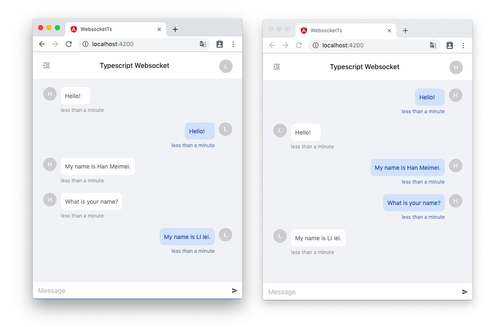

# 使用 Typescript 构建类型安全的 Websocket 应用

本文会通过一个简单的聊天室例子分享如何使用 Typescript 实现一个**类型安全 Websocket 应用**，在文章最后有 Github 项目地址。例子中的前端是使用 Angular 不过本文不会涉及相关知识点，其他框架使用者不必为此担心。



## 背景

当我们选择使用 Websocket 与服务器进行通讯时可能会遇到**多个消息类型复用一条连接**的情况，
这时就有希望有一个能够**根据消息类型来约束数据类型**的方案，以便在开发阶段发现问题并减低维护成本和提升开发体验。


假设我们约定的是这样的消息格式：

```json
{
  type: 'TYPE', // 消息类型
  data: {...}   // 数据
}

```

按照传统的设计思路我们可能会这样设计和使用：


```ts

// 消息服务

import { webSocket, WebSocketSubject } from 'rxjs/webSocket'

class MessageService {
  private ws: WebSocketSubject<any>;

  connect() {
    this.ws = webSocket({
      url: 'ws://localhost:8080/ws'
    });
  }

  send(type: string, data?:any) {
    this.ws.next({
      type,
      data
    });
  }
}

// 在组件中使用

class AppComponent {

  constructor(private messageService: MessageService)
    // 订阅消息
    this.messageService.subscribe(data => {
      switch (data.type) {
        case 'TYPE_1':
        ...
        case 'TYPE_2':
        ...
      }
    })
  }

  // 发送消息
  shend1() {
    this.messageService.send('TYPE_1', {...});
  }

  shend2() {
    this.messageService.send('TYPE_2', {...});
  }

}
```

这样的好处是使用非常灵活，几乎就是把 Rxjs 的 `webSocket` 返回直接提供给了开发者，不过缺点也很明显，就是上文提到的无法将消息类型和数据类型对应起来，尤其是在大型的 Websocket 应用中尤为突出。

为了解决这些问题，接下来我们会利用 Typescript 的一些高阶用法重新定义一个类型安全的 Websocket 应用。

## 类型定义

在开始之前我们需要先解释下文会用到的两个词的意思，避免混淆。

- 消息类型(用于区分不同行为的消息, 与 Typescript 无关)
- 数据类型(真正意义上的 Typescript 类型，对应每个消息的数据类型)


### 消息类型

为了区分不同行为的消息我们需要先定义消息类型的枚举，其中 `Receive` 是接收类型，`Send` 是发送类型。其实一个枚举就可以满足这个需求，不过为了覆盖更多在项目中可能会出现的情况这里声明了两个枚举。

```ts
export enum Receive {
  CONNECT = 'CONNECT',     // 连接成功
  USER_LIST = 'USER_LIST', // 聊天室用户列表
  MESSAGE = 'MESSAGE',     // 新消息
  JOINED = 'JOINED',       // 新用户加入
  LEAVE = 'LEAVE',         // 用户离开
  RENAME = 'RENAME',       // 用户重命名
}

export enum Send {
  JOINED = 'JOINED',              // 加入聊天室
  LEAVE = 'LEAVE',                // 离开聊天室
  RENAME  = 'RENAME',             // 重命名
  MESSAGE = 'MESSAGE',            // 发送新消息
  GET_USER_LIST = 'GET_USER_LIST' // 获取用户列表
}
```

*将枚举初始为字符串可以让我们直接获取到对应字符串*


### 数据类型

出于演示目的，这里的数据类型仅满足最小可用度，同时也是为了便于理解。

```ts

/** 用户 */
export type User = string;

/** 重命名 */
export interface Rename {
  user: User;    // 之前的用户名
  newName: User; // 新的用户名
}

/** 聊天消息体 */
export interface ChatMessage {
  form: User;      // 发送这条消息的用户
  content: string; // 消息正文
  time: number;    // 发送时的时间戳
}
```

### 类型映射

不同的消息类型对应了不同的数据, 这里我们再添加两个 interface 用于映射消息类型和数据类型的关系,其中 `key` 是消息类型 `value` 是与之对应的数据类型。

需要注意的是有些 `value` 的类型为 `never`, 这意味着它不需要要发送数据。

```ts
export interface MessageReceiveData {
  [Receive.CONNECT]: never;
  [Receive.USER_LIST]: User[];
  [Receive.MESSAGE]: ChatMessage;
  [Receive.JOINED]: User;
  [Receive.LEAVE]: User;
  [Receive.RENAME]: Rename;
}

export interface MessageSendData {
  [Send.MESSAGE]: ChatMessage;
  [Send.GET_USER_LIST]: never;
  [Send.JOINED]: User;
  [Send.LEAVE]: User;
  [Send.RENAME]: Rename;
}
```

### 消息格式

接下来定义我们约定的 Websocket 消息格式的类型

  ```ts

type DataType<T extends (Send | Receive)> = T extends Send ? MessageSendData[Send] : MessageReceiveData[Receive];

export interface MessageBody<T extends (Send | Receive)> {
  type: T;
  data: DataType<T>;
}

```

这里的 `T` 是范型，通过 `extends` 将它限制在了 `Send` 和 `Receive` 两个枚举之间。

`DataType` 是一个条件类型，用于确定在不同消息类型时返回正确的数据类型，理解这个简单的工具类型对阅读下面的内容很有帮助，这里举例稍做解释。

当 `T` 为 `Receive.USER_LIST` 时，将会返回如下类型

  ```ts
MessageBody<Receive.USER_LIST>

{
  type: 'USER_LIST',
  data: User[]
}

```

当 `T` 为 `Receive.CONNECT ` 时，将会返回如下类型。注意！这里因为对应的数据类型是 `never` 所以没有 `data` 属性。

```ts
MessageBody<Receive.CONNECT>

{
  type: 'CONNECT'
}

```

## Websocket 服务

重新修改最初版本的服务，为 `WebSocketSubject` 定义明确的类型，并添加一个 `receive` 方法通过一个 `Subject` 来分发消息。


```ts

class MessageService {
  // ws 同时控制着发送和接受，所以类型可能是 `Receive` 也肯能是 `Send `
  private ws: WebSocketSubject<MessageBody<Receive | Send>>;

  // 这个 Subject 充当分发接受消息的角色，其类型只可能是 `Receive `
  private received$ = new Subject<MessageBody<Receive>>();

  connect() {
    this.ws = webSocket({
      url: 'ws://localhost:8080/ws'
    });
    this.ws.subscribe(data => this.received$.next(data as MessageBody<Receive>));
  }

  receive<K extends Receive>(type: K): Observable<MessageReceiveData[K]> {
    return this.received$.pipe(
      filter(message => message.type === type),
      map(message => message.data)
    ) as Observable<MessageReceiveData[K]>;
  }

  ...
}

```

这里的 `receive` 方法同样接受一个范型，同时也是消息类型，并且返回在 `MessageReceiveData` 中对应的数据类型，这样我们便可以安全的使用 `receive` 方法来订阅消息在保证类型安全同时还能获得高级编辑器的智能提示功能。


```ts
class AppComponent {

  constructor(private messageService: MessageService)

    this.messageService
    .receive(Receive.CONNECT)
    .subscribe(() => {
      // 链接成功
    })

    this.messageService
    .receive(Receive.MESSAGE)
    .subscribe(data => {
      // 收到消息
      console.log(data.content) // 正常打印

      console.log(data.a) // Error Property 'a' does not exist on type 'ChatMessage'.
    })
  }
}
```

熟悉 `Rxjs` 的同学知道这里还需要做取消订阅处理，稍后我们会有统一的方案处理这个问题。

接受消息的问题解决了，接下来需要解决发送数据的问题了，不同的消息类型需要发送不同的数据，而比如上面的 `Send.GET_USER_LIST ` 类型这不需要发送数据，只需要发送对于的消息类型即可，要做到这一点我们希望 `send` 方法能根据类型识别需要的数据类型，同时还能支持无数据的消息类型。在开始之前我们先看看之前的 `send` 方法。

```ts
class MessageService {
  ...

  send(type: string, data?:any) {
    this.ws.next({
      type,
      data
    });
  }
}
```

可以看到这里的 `data` 参数是可选的，就是为了应对无数据的消息类型，现在我们希望 Typescript 在知道 `type` 的情况下能明确告诉我们是否需要 `data`，以及什么类型的 `data`。请考虑下面这种实现方式。


```ts
  send<K extends Send>(type: K, data?: MessageSendData[K]) {
    this.ws.next({
      type,
      data
    });
  }

  send<Send.GET_USER_LIST>(Send.GET_USER_LIST); // 正常工作切不报错
  send<Send.MESSAGE>(Send.MESSAGE, message); // 正常工作且能正确识别类型

  send<Send.RENAME>(Send.RENAM); // 不能正常工作，但是不报错
```

这样的确可以知道 `data` 的类型，不过由于有些消息类型不需要 `data`，所以类型是可选的，这导致我们无法确切的知道一个消息类型是否需要 `data`。 有没有什么办法可以同时兼顾着两需求呢？请再考虑下面的实现方式。

```ts

type ArgumentsType<T> = T extends (...args: infer U) => void ? U : never;

type SendArgumentsType<T extends keyof MessageSendData> =
  MessageSendData[T] extends never
  ? ArgumentsType<(type: T) => void>
  : ArgumentsType<(type: T, data: MessageSendData[T]) => void>;

 send<K extends Send>(...args: SendArgumentsType<K>) {
    const [type, data] = args;
    this.ws.next(
      {
        type,
        data
      }
    );
  }
```

这段代码看上去感觉很复杂，也许还有些没见过的操作符，我们首先来看看 `ArgumentsType` 类型。

这里它接受一个范型，如果是个方法则返回 `U`，那么这个 `U` 是哪里来的呢？是通过 `infer` 操作符推导出来的，这里推导的是传入方法的参数，而且是通过参数展开操作符(...) 展开后的数组，实际使用的效果是这样的。

```ts
type ArgumentsType<T> = T extends (...args: infer U) => void ? U : never;

// 正确返回函数参数类型数组
ArgumentsType<(string, number) => void>; // [string, number];
ArgumentsType<(boolean) => void>; // [boolean];
ArgumentsType<() => void>; // [];

// 错误的输入返回 naver
ArgumentsType<string> // never
```

现在再来看`SendArgumentsType` 类型，首先判断 `MessageSendData[T]` 类型是不是 `naver`, 如果是的话则通过 `ArgumentsType` 来返回无数据的参数类型，否则就通过 `ArgumentsType` 来返回对应消息类型的参数类型。

```ts
export type SendArgumentsType<T extends keyof MessageSendData> =
  MessageSendData[T] extends never
  ? ArgumentsType<(type: T) => void>
  : ArgumentsType<(type: T, data: MessageSendData[T]) => void>;


// 需要发送数据的类型正确返回消息类型和数据类型
SendArgumentsType<Send.MESSAGE> // [Send.MESSAGE, ChatMessage]
SendArgumentsType<Send.RENAME> // [Send.RENAME, Rename]

// 不需要发送数据的类型只返回消息类型
SendArgumentsType<Send.GET_USER_LIST> // [Send.GET_USER_LIST]
```

现在我们利用参数展开操作符(...)，将 `shend` 方法的参数展开成数组，再利用 `SendArgumentsType` 类型就能实现我们想要的功能了。

```ts
  send<Send.GET_USER_LIST>(Send.GET_USER_LIST); // 正常工作切不报错
  send<Send.MESSAGE>(Send.MESSAGE, message); // 正常工作且能正确识别类型
  send<Send.RENAME>(Send.RENAM); // 不能正常工作，能正确报错
```

现在我们发送/接受消息都能正确提示和约束类型了。


```ts
class AppComponent {

  username = '';

  constructor(private messageService: MessageService)

    this.messageService
    .receive(Receive.CONNECT)
    .subscribe(() => {
      // 链接成功
      this.getUserList();
    })

    this.messageService
    .receive(Receive.MESSAGE)
    .subscribe(data => {
      // 收到消息
    })
  }

  getUserList() {
    this.messageService.send<Send.GET_USER_LIST>(Send.GET_USER_LIST);
  }

  join(username: string) {
    this.username = username;
    this.messageService.send<Send.JOINED>(Send.JOINED, this.username);
  }

  rename(username: string) {
    const data = {
      user: this.username,
      newName: username
    };
    this.messageService.send<Send.RENAME>(Send.RENAME, data);
  }

  sendMessage(content: string) {
    const message = {
      content,
      form: this.username,
      time: Date.now()
    };
    this.messageService.send<Send.MESSAGE>(Send.MESSAGE, message);
  }
}
```

## 更近一步

看上去我们的问题已经解决了，不过订阅消息的方式还是显得很臃肿，而且还有取消订阅的问题没有解决，如果应用中很多组件都订阅了消息，那么光是维护订阅也会花费不少的时间了精力。所以接下来我们还要继续改造我们的应用，添加一个订阅管理器已经订阅装饰器，让我们能够像下面这样订阅消息，并且不用关心取消订阅的问题。

```ts
class AppComponent {

  username = '';

  constructor(private messageService: MessageService)

    this.messageService
    .receive(Receive.CONNECT)
    .subscribe(() => {
      // 链接成功
    })

    this.messageService
    .receive(Receive.MESSAGE)
    .subscribe(data => {
      // 收到消息
    })

    this.messageService
    .receive(Receive.USER_LIST)
    .subscribe(data => {
      // 更新用户列表
    })
  }
}
```

上面的代码依然存在两个问题：

1. 所有的订阅都集中在一个方法里，显得这个方法过于臃肿
2. 还需要花费不少的精力管理取消订阅

所以现在我们要着手解决这两个问题，让一个方法负责一个类型的消息，同时不再需要关心取消订阅的问题，就像下面这样。

```ts
export class AppComponent extends MessageListenersManager {

  constructor(private messageService: MessageService) {
    super(messageService);
  }

  @MessageListener(Receive.CONNECT)
  onConnect() {
    // 链接成功
  }

  @MessageListener(Receive.MESSAGE)
  addMessage(message: ChatMessage) {
    // 收到消息
  }

  @MessageListener(Receive.USER_LIST)
  updateUserList(users: User[]) {
    // 收到用户列表
  }
}
```

### 订阅管理器

我们先完成 `MessageListenersManager` 类，它的目的主要有两个一是确保派生类注入 `MessageService` 实例，二是通过一些方法管理 `Subscription` 并在合适的时机取消订阅，它的实现是这样的。

```ts
export class MessageListenersManager {

  static __messageListeners__: Function[] = [];
  readonly __messageListenersTakeUntilDestroy$__ = new Subject<void>();

  constructor(public messageService: MessageService) {
    while (MessageListenersManager.__messageListeners__.length > 0) {
      const fun = MessageListenersManager.__messageListeners__.pop();
      fun.apply(this);
    }
  }

  ngOnDestroy(): void {
    this.__messageListenersTakeUntilDestroy$__.next();
    this.__messageListenersTakeUntilDestroy$__.complete();
  }
}

```

首先定义一个静态属性 `__messageListeners__`，用于存放创建订阅的方法，然后再 constructor 里面依次执行它们以创建订阅，但是为什么要用静态属性呢？因为在成员装饰器被调用的时候类还没有被构造，无法访问内部的属性，只有静态属性可以在构造前被访问。之后再创建一个名为 `__messageListenersTakeUntilDestroy$__` 的 `Subject` 再订阅时放在 Rxjs 操作符 `takeUntil` 里用于取消订阅，最后在 `ngOnDestroy` 生命周期里调用以取消订阅。

### 订阅装饰器

接下来创建一个成员装饰器，创建指定消息类型的订阅然后将方法推入 `__messageListeners__ `，这里的 `ReceiveArgumentsType` 类型是用来约束被装饰方法的参数类型。

```ts

export type ReceiveArgumentsType<
  T extends keyof MessageReceiveData
  > = MessageReceiveData[T] extends undefined
  ? () => void
  : (data?: MessageReceiveData[T]) => void;

export function MessageListener<T extends keyof MessageReceiveData>(type: T) {
  return (
    target: MessageListenersManager,
    propertyKey: string,
    descriptor: TypedPropertyDescriptor<ReceiveArgumentsType<T>>) => {

    // 获取构造上的静态属性 `__messageListeners__ `
    const constructor = Object.getPrototypeOf(target).constructor;
    if (constructor && constructor.__messageListeners__) {

      // 将创建订阅的方法推入 `__messageListeners__ `, 以便在构造时调用
      constructor.__messageListeners__.push(function() {

        // 创建指定类型的订阅
        this.messageService.receive(type)
        // 使用 `takeUntil ` 操作符以便自动取消订阅
        .pipe(takeUntil(this.__messageListenersTakeUntilDestroy$__))
        .subscribe(data => {

          // 收到返回后调用被装饰得方法
          descriptor.value.call(this, data);
        });
      });
    }
    return descriptor;
  };
```

现在我们就可以像下面这样订阅和发送 Websocket 消息了：

```ts
export class AppComponent extends MessageListenersManager {

  username = '';

  constructor(private messageService: MessageService) {
    super(messageService);
  }

  @MessageListener(Receive.CONNECT)
  onConnect() {
    // 链接成功
  }

  @MessageListener(Receive.MESSAGE)
  addMessage(message: ChatMessage) {
    // 收到消息
  }

  @MessageListener(Receive.USER_LIST)
  updateUserList(users: User[]) {
    // 收到用户列表
  }

  getUserList() {
    // 获取用户列表
    this.messageService.send<Send.GET_USER_LIST>(Send.GET_USER_LIST);
  }

  join(username: string) {
    // 加入聊天室
    this.username = username;
    this.messageService.send<Send.JOINED>(Send.JOINED, this.username);
  }

  rename(username: string) {
    // 重命名
    const data = {
      user: this.username,
      newName: username
    };
    this.messageService.send<Send.RENAME>(Send.RENAME, data);
  }

  sendMessage(content: string) {
    // 发送新消息
    const message = {
      content,
      form: this.username,
      time: Date.now()
    };
    this.messageService.send<Send.MESSAGE>(Send.MESSAGE, message);
  }
}
```

## 总结

我们使用 Typescript 实现了在多类型消息复用一条 Websocket 连接下的类型安全，让我们能在编译阶段发现类型的使用错误以及编辑器的智能提示，同时利用装饰器让我们能够跟好的组织订阅消息的代码。充分利用 Typescript 的强大特性而不是仅仅使用 interface 能在保证项目健壮的同时提高开发体验，感谢阅读 Happy coding !

- [hsuanxyz/ts-websocket](https://github.com/hsuanxyz/ts-websocket)
